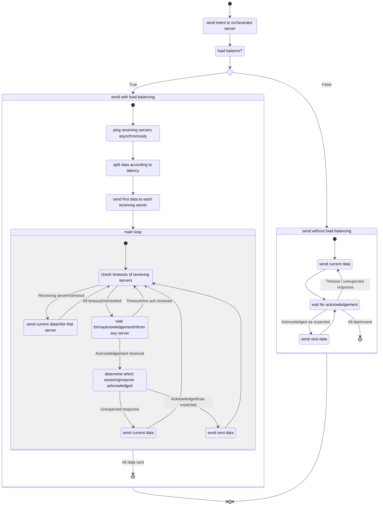

# 1. Multi Destination Application Layer Protocol Client
Send data to a MDALP server. 

Contacts an *orchestrator* server to receive a list of *receiving* servers. Distributes sending of data to receiving servers according to latency.

<!-- omit in toc -->
## Table of contents
- [1. Multi Destination Application Layer Protocol Client](#1-multi-destination-application-layer-protocol-client)
  - [1.1. Requirements](#11-requirements)
- [2. Implementation level](#2-implementation-level)
- [3. Overview](#3-overview)
- [4. Documentation](#4-documentation)
  - [4.1. Utility functions](#41-utility-functions)
    - [4.1.1. argsort](#411-argsort)
    - [4.1.2. normalize to sum](#412-normalize-to-sum)
    - [4.1.3. split by ratio](#413-split-by-ratio)
    - [4.1.4. get average ping](#414-get-average-ping)
    - [4.1.5. get latencies](#415-get-latencies)
    - [4.1.6. batch seq](#416-batch-seq)
  - [4.2. MDALP abstract class](#42-mdalp-abstract-class)
    - [4.2.1. init](#421-init)
    - [4.2.2. enter](#422-enter)
    - [4.2.3. close](#423-close)
    - [4.2.4. exit](#424-exit)
    - [4.2.5. parse message](#425-parse-message)
    - [4.2.6. send packet](#426-send-packet)
    - [4.2.7. recv packet](#427-recv-packet)
    - [4.2.8. recv packet from](#428-recv-packet-from)
  - [4.3. MDALPRecvClient](#43-mdalprecvclient)
    - [4.3.1. init](#431-init)
    - [4.3.2. properties](#432-properties)
    - [4.3.3. reset](#433-reset)
    - [4.3.4. get curr data](#434-get-curr-data)
    - [4.3.5. get next data](#435-get-next-data)
    - [4.3.6. send curr](#436-send-curr)
    - [4.3.7. send next](#437-send-next)
  - [4.4. MDALPClient](#44-mdalpclient)
    - [4.4.1. send intent](#441-send-intent)
    - [4.4.2. send single server](#442-send-single-server)
    - [4.4.3. send load balance](#443-send-load-balance)
    - [4.4.4. send](#444-send)
  - [4.5. main](#45-main)
    - [4.5.1. command-line parsing](#451-command-line-parsing)
- [5. Load balancing vs Non load balancing](#5-load-balancing-vs-non-load-balancing)
  - [5.1. Load balancing](#51-load-balancing)
  - [5.2. Non load balancing](#52-non-load-balancing)
    - [Server A](#server-a)
    - [Server B](#server-b)
    - [Server C](#server-c)
  - [5.3. Comparison](#53-comparison)

## 1.1. Requirements
```
Python >= 3.6
```
    
# 2. Implementation level
Level 4
- Able to send Type 0 messages, and solicit Type 1 message reply from the orchestrator server.
- Able to send payload to a single receiving server among those listed by the receiving server. Able to do retransmissions properly.
- Able to load-balance across several receiving servers specified by the the orchestrator server, in a way compliant with specifications given (ratio, sequence number, etc.).
- Submission has a performance comparison between load-balancing and non-load-balancing modes.

<div style="page-break-after: always;"></div>

# 3. Overview
The following shows the overview of how the load balancing send and non load balancing send work. Observe that in both modes, it uses the **stop-and-wait** protocol to send packets to a receiving server as required in the specifications. But in load balancing mode, it is able to handle multiple receiving servers at once which effectively saves time by *asynchronously* sending data.


<div style="page-break-after: always;"></div>

# 4. Documentation
Import required python modules.
```python
import argparse
import asyncio
import itertools
import logging
import socket
import selectors
import re
import math
import platform
from subprocess import SubprocessError
from time import perf_counter
from typing import Any, Dict, Iterable, Iterator, List, Sequence, Tuple, Union
```
Initialize logging for logging messages.
```python
logging.basicConfig()
logger = logging.getLogger(__name__)
```

## 4.1. Utility functions
### 4.1.1. argsort
```python
def argsort(seq: Sequence, *args, **kargs) -> List:
    '''Returns the indices that would sort an array.

    Args:
        seq (Sequence): Sequence to sort.

    Returns:
        List: List of indices that sort `seq`.
    '''
```
Sorts the indices using the `seq.__getitem__` key which effectively produces the indices that would sort an array.
```python
    return sorted(range(len(seq)), key=seq.__getitem__, *args, **kargs)
```

### 4.1.2. normalize to sum
```python
def normalize_to_sum(iter: Iterable[Union[int, float]]) -> List[float]:
    '''Returns the scaled `iter` to have a sum of 1.

    Args:
        iter (Iterable[Union[int, float]]): The iterable to normalize.

    Returns:
        List[float]: Scaled `iter`
    '''
    it1, it2 = itertools.tee(iter)
```
Get the sum and divide each value by the sum.
```python
    total = sum(it1)
    return [float(i) / total for i in it2]
```

### 4.1.3. split by ratio
```python
def split_by_ratio(seq: Sequence,
                   weights: Iterable,
                   min_length: int = 0) -> Iterator[Sequence]:
    '''Split `seq` according to `weights`. Tries to satisfy the optional
    `min_length` argument.

    Args:
        seq (Sequence): Sequence to split
        weights (Iterable): Ratio
        min_length (int, optional): Minimum splice length. Defaults to 0.

    Yields:
        Iterator[Sequence]: a splice of `seq`
    '''
    ratio_norm = normalize_to_sum(weights)
    ratio_norm_argsort = argsort(ratio_norm)

    seq_len = len(seq)
    sub_seq_lens = [0] * len(ratio_norm)
```
Keep track of the remaining allocations left in `remaining`.
```python
    remaining = seq_len
```
Iterate over the ratios in increasing order. Allocate with minimum length of `min_length` and maximum length of `remaining`. Subtract the allocated `sub_len` from `remaining`.
```python
    for idx, ratio in zip(ratio_norm_argsort, sorted(ratio_norm)):
        sub_len = min(max(round(ratio * seq_len), min_length), remaining)
        remaining -= sub_len
        sub_seq_lens[idx] = sub_len
```
Calculate the resulting split indices and store it to `splits`.
```python
    splits = [0]
    for sub_len in sub_seq_lens:
        splits.append(splits[-1] + sub_len)

    for start, end in zip(splits, splits[1:]):
        yield seq[start:end]
```
### 4.1.4. get average ping
```python
async def get_average_ping(host: str, n: int = 3) -> float:
    '''Async function to get average ping of `n` echo requests to `host`

    Args:
        host (str): host
        n (int, optional): Number of echo requests. Defaults to 3.

    Raises:
        SubprocessError: OS ping command error
        RuntimeError: Cannot parse ping command

    Returns:
        float: Average ping
    '''
    number = r'\d+(?:\.\d+)?'
```
Initialize platform dependent flags and regex patterns.
```python
    if platform.system().lower() == 'windows':
        count_flag = '-n'
        pattern = f'Average = ({number})ms'
    else:
        count_flag = '-c'
        pattern = f'min/avg/max/mdev = {number}/({number})'
```
Create the ping subprocess. Pipe the stdout.
```python
    proc = await asyncio.create_subprocess_exec('ping',
                                                count_flag,
                                                str(n),
                                                host,
                                                stdout=asyncio.subprocess.PIPE)
```
Get the output and parse the average ping using regex.
```python
    stdout, stderr = await proc.communicate()
    if proc.returncode < 0:
        raise SubprocessError('ping command error')
    match = re.search(pattern, stdout.decode())
    if match is None:
        raise RuntimeError(
            f'no match found for pattern {pattern} in output\n{stdout}')
    average = float(match.group(1))
    return average
```
### 4.1.5. get latencies
Pings the hosts *asynchronously*.
```python
def get_latencies(hosts: Iterable[str]) -> List:
    '''Returns a list of the round trip times of `hosts`

    Args:
        hosts (Iterable[str]): Hosts

    Returns:
        List: List of round trip times
    '''
```
Create a list of Coroutine objects.
```python
    async_pings = [get_average_ping(host) for host in hosts]
```
Gather the Coroutines into a Future object. Get an async event loop and run the Future and get the return values.
```python
    pings_future = asyncio.gather(*async_pings)

    loop = asyncio.get_event_loop()
    returns = loop.run_until_complete(pings_future)
    if not loop.is_running(): loop.close()

    return returns
```
### 4.1.6. batch seq
```python
def batch_seq(seq: Sequence, size: int) -> Iterator[Sequence]:
    '''Batch a sequence into `size` lenghts

    Args:
        seq (Sequence): The sequence
        size (int): Length size

    Returns:
        Iterator[Sequence]: Batched `seq`
    '''
    return (seq[i:i + size] for i in range(0, len(seq), size))
```
## 4.2. MDALP abstract class
```python
class MDALP:
```
### 4.2.1. init
Create the socket if not provided. Create a selector and register the socket for read events.
```python
def __init__(self, addr, sock: socket.socket = None):
    '''
    Args:
        addr: IP address of the server
        sock (socket.socket, optional): Socket to use, creates a new socket object if None. Defaults to None.
    '''
    self._sock: socket.socket = sock if sock is not None else socket.socket(
        socket.AF_INET, socket.SOCK_DGRAM)
    self._sock.setblocking(False)
    self._sel = selectors.DefaultSelector()
    self._sel.register(self._sock, selectors.EVENT_READ)
    self._addr = addr
```
### 4.2.2. enter
Used by Python's context manager.
```python
def __enter__(self):
    return self
```
### 4.2.3. close
Unregeisters the socket and closes the socket.
```python
def close(self):
    '''Call when done'''
    self._sel.unregister(self._sock)
    self._sock.close()
    logger.info(f'MDALP: {self._addr} closed.')
```
### 4.2.4. exit
Used by Python's context manager. Call close on exit.
```python
def __exit__(self, type, value, traceback):
    self.close()
```
### 4.2.5. parse message
Parses a message into a dictionary using regex pattern matching.
```python
@staticmethod
def _parse_message(message: str) -> Dict[str, Any]:
    '''Parses a message into a dictionary

    Args:
        message (str): Message

    Returns:
        Dict[str, Any]: Parsed info, None if pattern matching failed.
    '''
```
Add a `;` at the end for consistency when needed.
```python
    if len(message) > 0 and message[-1] != ';': message += ';'
```
Produce the regex pattern with the appropriate named capture groups.
```python
    fields = [
        ('Type', r'\d+'),
        ('TID', r'\d+'),
        ('SEQ', r'\d+'),
        ('DATA', r'.*')  # greedy
    ]
    regex = ''.join('({0}:(?P<{0}>{1});)?'.format(*field)
                    for field in fields)
```
Match with the message and get the dictionary of named capture groups and its values.
```python
    match = re.match(regex, message)
    if match is None: return None

    parsed = match.groupdict()
```
Convert to appropriate types then return the dictionary.
```python
    for field in fields[0:3]:
        name = field[0]
        if parsed.get(name) is not None: parsed[name] = int(parsed[name])

    if parsed.get('Type') == 1 and parsed.get('DATA') is not None:
        parsed['DATA'] = eval(parsed['DATA'])

    logger.debug(f'Parsed data: {parsed}')
    return parsed
```
### 4.2.6. send packet
```python
def send_packet(self,
                type: int,
                tid: int = None,
                seq: int = None,
                data: bytes = None) -> int:
    '''Send a packet

    Args:
        type (int): Packet type
        tid (int, optional): Transaction ID. Defaults to None.
        seq (int, optional): Sequence number. Defaults to None.
        data (bytes, optional): Payload. Defaults to None.

    Returns:
        int: Number of bytes of `data` sent not including header.
    '''
```
Create the packet header and append the payload (if needed) based on provided arguments.
```python
    header = f'Type:{type};'
    if tid is not None: header += f'TID:{tid};'
    if seq is not None: header += f'SEQ:{seq};'
    header = header.encode()

    payload = b''
    if data is not None:
        header += b'DATA:'
        payload = data

    message = header + payload
```
Send the produced message.
```python
    ret = max(0, self._sock.sendto(message, self._addr) - len(header))
    logger.debug(f'client -> {self._addr} (return {ret}): {message}')
    return ret
```
### 4.2.7. recv packet
```python
def recv_packet(self,
                buf_size: int = 1024,
                timeout: float = None) -> Dict[str, Any]:
    '''Returns parsed message received

    Args:
        buf_size (int, optional): Buffer size. Defaults to 1024.
        timeout (float, optional): Timeout in seconds. Defaults to None.

    Returns:
        Dict[str, Any]: Parsed message.
    '''
```
Wait for a read event from the selector. Pass the timeout argument.
```python
    events = self._sel.select(timeout)
    if len(events) == 0:
        logger.info(f'Receive timeout!')
        return None
```
A read is available. Read the data and get the address from where it came from.
```python
    data, addr = self._sock.recvfrom(buf_size)
```
Check if the address and data are correct then parse and return it.
```python
    if addr != self._addr:
        logger.info(
            f'Data received from {addr}, expected address is {self._addr}.')
        return None

    if not data:
        logger.info(f'Data received from {addr} is empty.')
        return None

    data = data.decode()
    parsed = self._parse_message(data)
    if parsed is None: logger.warn(f'Parsed failed with data {data}')
    return parsed
```
### 4.2.8. recv packet from
```python
def recv_packet_from(self,
                        buf_size: int = 1024,
                        timeout: float = None) -> Tuple[Dict[str, Any], Any]:
    '''Returns tuple of parsed message and address of sender

    Args:
        buf_size (int, optional): Buffer size. Defaults to 1024.
        timeout (float, optional): Timeout in seconds. Defaults to None.

    Returns:
        Tuple[Dict[str, Any], Any]: Parsed message and address
    '''
```
Wait for a read event from the selector. Pass the timeout argument.
```python
    events = self._sel.select(timeout)
    if len(events) == 0:
        logger.info(f'Receive timeout!')
        return None, None
```
A read is available. Read the data and get the address from where it came from.
```python
    data, addr = self._sock.recvfrom(buf_size)
```
Check if the data is correct then parse and return it with the address.
```python
    if not data:
        logger.info(f'Data received from {addr} is empty.')
        return None, None

    data = data.decode()
    parsed = self._parse_message(data)
    if parsed is None: logger.warn(f'Parsed failed with data {data}')
    return parsed, addr
```
## 4.3. MDALPRecvClient
Used to interface with the receiving servers.
```python
class MDALPRecvClient(MDALP):
'''Client class for the MDALP receiving server.'''
```
### 4.3.1. init
Assign a data sequence to be sent to the receiving server and a base sequence number.
```python
def __init__(self,
             addr,
             sock: socket.socket,
             tid: int,
             data_seq: Sequence[bytes],
             seq_start: int = 0):
    '''
    Args:
        addr ([type]): IP address of the server
        sock (socket.socket): Socket to use
                              Usually the socket of the   MDALP client
        tid (int): Transaction ID
        data_seq (Sequence[bytes]): Data to be sent to the receiving server
        seq_start (int, optional): Starting sequence number. Defaults to 0.
    '''
    super().__init__(addr, sock=sock)
    self._tid = tid
    self._last_send = None
    self._seq = tuple(data_seq)
    self._base = seq_start
    self._curr_idx = 0
```
### 4.3.2. properties
Length of the data assigned.
```python
@property
def data_len(self) -> int:
    return len(self._seq)
```
The minimum sequence number. The base sequence number.
```python
@property
def seq_min(self) -> int:
    return self._base
```
The maximum sequence number.
```python
@property
def seq_max(self) -> int:
    return len(self._seq) + self._base - 1
```
The current sequence number in iteration.
```python
@property
def seq_curr(self) -> int:
    return self._curr_idx + self._base
```
Set the current sequence number. Internally, modifies the current index.
```python
@seq_curr.setter
def seq_curr(self, i: int):
    self._curr_idx = i - self._base
```
Returns a bool that indicates if iteration is finished.
```python
@property
def data_exhausted(self) -> bool:
    return self._curr_idx >= len(self._seq)
```
Returns the time elapsed in seconds since the last send.
```python
@property
def time_since_last_send(self) -> float:
    return perf_counter() - self._last_send
```
### 4.3.3. reset
Resets the iteration.
```python
def reset(self):
    '''Reset data iteration'''
    self._curr_idx = 0
```
### 4.3.4. get curr data
Return the current data in iteration if there is any, else returns None.
```python
def get_curr_data(self) -> bytes:
    '''Returns the current data in iteration

    Returns:
        bytes: Bytes of data, None if iteration is finished
    '''
    return self._seq[self._curr_idx] if not self.data_exhausted else None
```
### 4.3.5. get next data
Return the next data in iteration if there is any, else returns None. Increments the index / sequence number.
```python
def get_next_data(self) -> bytes:
    '''Returns the next data in iteration.
    Current index/sequence is incremented

    Returns:
        bytes: Bytes of data, None if iteration is finished
    '''
    self._curr_idx = min(self._curr_idx + 1, len(self._seq))
    if self.data_exhausted: return None
    return self._seq[self._curr_idx]
```
### 4.3.6. send curr
Send the current data in iteration. If it exists, returns True, else nothing is done and returns False.
```python
def send_curr(self) -> bool:
    '''Sends the current data in iteration

    Returns:
        bool: Returns True if there was data to send, else False
    '''
    data = self.get_curr_data()
    if data is None: return False
    self.send_packet(type=2, tid=self._tid, seq=self.seq_curr, data=data)
    self._last_send = perf_counter()
    return True
```
### 4.3.7. send next
Send the next data in iteration. If it exists, returns True, else nothing is done and returns False.
```python
def send_next(self) -> bool:
    '''Sends the next data in iteration
    Current index/sequence is incremented

    Returns:
        bool: Returns True if there was data to send, else False
    '''
    data = self.get_next_data()
    if data is None: return False
    self.send_packet(type=2, tid=self._tid, seq=self.seq_curr, data=data)
    self._last_send = perf_counter()
    return True
```
## 4.4. MDALPClient
The class that is mainly used. Used to interface with the orchestrator server and instantiates the MDALPRecvClient class to interface with multiple receiving servers too.
```python
class MDALPClient(MDALP):
    '''Client class for the MDALP orchestrator server.'''
    MAX_PAYLOAD = 100
    RECV_PORT = 4650
    TIMEOUT = 3
    TIMEOUT_INTENT = 120
    MIN_RATIO = 0.1
```
### 4.4.1. send intent
Sends a type 1 message to the orchestrator server and returns the parsed response.
```python
def _send_intent(self) -> Dict[str, Any]:
    '''Returns the parsed type 1 message after sending the type 0.

    Returns:
        Dict[str, Any]: Parsed message
    '''
    self.send_packet(0)
    logger.info(f'Intent message sent to {self._addr}.')
    response = None
    while response is None:
        response = self.recv_packet(timeout=self.TIMEOUT_INTENT)

    if response.get('Type') != 1: return None
    logger.info(f'Response: {response}')
    return response
```
### 4.4.2. send single server
Used to send data to a single server without load balancing.
```python
def _send_single_server(self, host: str, tid: int, data: bytes) -> int:
    '''Send `data` to `host` with transactio ID `tid`.

    Args:
        host (str): Host
        tid (int): Transaction ID
        data (bytes): Data

    Returns:
        int: Number of data in bytes sent
    '''
```
Instantiate an MDALPRecvClient object. Assign all the data to it. Pass a duplicate of own socket.
```python
    addr = (host, self.RECV_PORT)
    server = MDALPRecvClient(addr, self._sock.dup(), tid,
                                batch_seq(data, self.MAX_PAYLOAD))
```
Send the first packet.
```python
    ret = 0
    server.send_curr()
```
While not all data is sent, wait for a response with a timeout of `self.TIMEOUT`.
```python
    while not server.data_exhausted:
        response = server.recv_packet(timeout=self.TIMEOUT)
```
On timeout, resend the current data.
```python
        if response is None:
            server.send_curr()
            continue
```
If the response message is not as expected, resend the current data.
```python
        if not all((response.get('Type') == 3, response.get('TID')
                    == tid, response.get('SEQ') == server.seq_curr)):
            server.send_curr()
            continue
```
The data sent is successfully acknowledged. Add the number of data bytes sent. Send the next data.
```python
        ret += len(server.get_curr_data())
        server.send_next()
```
Return the number of data bytes sent.
```python
    return ret
```
### 4.4.3. send load balance
Send data with load balancing.
```python
def _send_load_balance(self, hosts: Iterable[str], tid: int,
                        data: bytes) -> int:
    '''Send `data` to `hosts` with transactio ID `tid`.
    Load balances using the inverse of round trip times

    Args:
        hosts (Iterable[str]): Hosts
        tid (int): Transaction ID
        data (bytes): Data

    Returns:
        int: Number of data in bytes sent
    '''
    hosts = list(hosts)
```
Get the latencies of the hosts. Split the data by the inverse of the latencies. This way, more data is allocated for receiving servers with lower latencies.
```python
    # get round trip times
    latencies = get_latencies(hosts)
    # split by inverse of RTTs
    split_data = split_by_ratio(data, (1 / l for l in latencies),
                                math.ceil(self.MIN_RATIO * len(data)))
```
Instantiate the MDALPRecvClient objects with the correct data assignment and base sequence numbers.
```python
    recv_servers: List[MDALPRecvClient] = []
    seq_base = 0
    for host, d in zip(hosts, split_data):
        addr = (host, self.RECV_PORT)
        recv_servers.append(
            MDALPRecvClient(addr, self._sock.dup(), tid,
                            batch_seq(d, self.MAX_PAYLOAD), seq_base))
        seq_base += recv_servers[-1].data_len
```
Output the summary.
```python
    # summary
    for server, latency in zip(recv_servers, latencies):
        logger.info(
            f'addr: {server._addr}, latency: {latency}, data_len: {server.data_len}'
        )
```
Send the first packet of each receiving server.
```python
    ret = 0
    # initial send
    for server in recv_servers:
        server.send_curr()
```
Loop while not all of the data is sent.
```python
    # send the rest
    while any(map(lambda s: not s.data_exhausted, recv_servers)):
```
Check for time elapsed since last send for each server, resend the current data for each server that reached timeout.
```python
        # check server timeouts
        for server in recv_servers:
            if server.data_exhausted: continue
            if server.time_since_last_send >= self.TIMEOUT:
                logger.info(
                    f'Timeout! {server._addr} | seq: {server.seq_curr}')
                server.send_curr()
```
Wait for a maximum of `self.TIMEOUT` to receive a packet. If no packet is received, `continue`.
```python
        response, addr_from = self.recv_packet_from(timeout=self.TIMEOUT)
        if response is None: continue
```
Check the received packet and identify the receiving server that acknowledged. If not found, `continue`. 
```python
        if not (response.get('Type') == 3 and response.get('TID') == tid):
            continue

        server = next((s for s in recv_servers if s._addr == addr_from),
                        None)
        if server is None: continue
```
Update the sequence number if needed.
```python
        if response.get('SEQ') != server.seq_curr:
            # not expected acknowledgement sequence number
            new_seq = response.get('SEQ') + 1
            if server.seq_min <= new_seq <= server.seq_max:
                logger.info(
                    f'Server {server._addr}: Seq number mismatch. Updating seq_curr to {new_seq} from {server.seq_curr}.'
                )
                server.seq_curr = new_seq
```
All checks to the received packet passed. The receiving server acknowledged as expected. Send the next data.
```python
        # server acknowledged as expected
        ret += len(server.get_curr_data())
        server.send_next()
```
Close the socket used for each receiving server and return the number of data bytes sent.
```python
    for s in recv_servers:
        s.close()

    return ret
```
### 4.4.4. send
```python
def send(self,
            data: bytes,
            load_balance: bool = True,
            nth_server: int = 1) -> int:
    '''Send data.

    Args:
        data (bytes): Data to send
        load_balance (bool, optional): Flag if load balancing should be used. Defaults to True.
        nth_server (int, optional): The 1-indexed server number to use. Defaults to 1.

    Returns:
        int: Number of data in bytes sent
    '''
```
Send intent message to orchestrator server. Get the transaction ID and produce the list of receiving servers.
```python
    response = self._send_intent()
    if response is None: return 0

    tid = response.get('TID')
    if tid is None: return 0

    hosts = [server.get('ip_address') for server in response.get('DATA')]
    if len(hosts) == 0: return 0
```
Send the data and return the number of bytes sent. Take the performance in terms of elapsed time and log it.
```python
    start = perf_counter()
    ret = 0
    if load_balance:
        ret = self._send_load_balance(hosts, tid, data)
    else:
        ret = self._send_single_server(hosts[nth_server - 1], tid, data)
    end = perf_counter()

    logger.info(f'Send took {end - start}s.')
    return ret
```
## 4.5. main
```python
def main(args):
```
Set logging level based on command-line argument.
```python
    if args.verbose == 1:
        logger.setLevel(logging.INFO)
    elif args.verbose >= 2:
        logger.setLevel(logging.DEBUG)
    else:
        logger.setLevel(logging.WARNING)

    logger.info(f'Parsed args: {args}')
```
Send the data. Use a context manager using the `with` and `as` keywords.
```python
    with MDALPClient((args.addr, args.port)) as client:
        data = args.file.read().encode()
        if args.mode == 1:
            ret = client.send(data)
        else:
            ret = client.send(data, load_balance=False, nth_server=args.server)
        logger.debug(f'return: {ret} | data length: {len(data)}')
```
### 4.5.1. command-line parsing
Create a parser based on the project specifications.
```python
if __name__ == '__main__':
    parser = argparse.ArgumentParser(
        description=
        'Send text files using  multidestination application-layer protocol (MDALP)',
        add_help=False)

    required = parser.add_argument_group(title='required arguments')
    optional = parser.add_argument_group(title='optional arguments')

    required.add_argument('-a',
                          '--addr',
                          required=True,
                          help='IPv4 address of the server')
    required.add_argument('-p',
                          '--port',
                          required=True,
                          type=int,
                          help='UDP port of the server')
    required.add_argument('-f',
                          '--file',
                          type=argparse.FileType(mode='r', encoding='UTF-8'),
                          required=True,
                          help='filename of the payload')

    optional.add_argument('-h',
                          '--help',
                          action='help',
                          default=argparse.SUPPRESS,
                          help='show this help message and exit')
    optional.add_argument('-v', '--verbose', action="count", default=0)
    optional.add_argument(
        '-m',
        '--mode',
        default=1,
        type=int,
        choices=[1, 2],
        help='mode of the load balancing {1=load balance, 2=no load balancing}'
    )
    optional.add_argument(
        '-s',
        '--server',
        default=1,
        type=int,
        help='index of the server to use when no load balancing mode is used')

    args = parser.parse_args()

    main(args)
```

# 5. Load balancing vs Non load balancing
Just from the concept and the code, we could infer that load balancing should be able to send a payload faster. Here, we look at a specific case, observing the logs and tracefiles.

## 5.1. Load balancing
We look at a specific transaction with load balancing with `TID=3740`. Observe that the transaction completed.


The following shows the `DEBUG` level logs from the MDALP client. The command used to send this is
```bash
python3 mdalp.py -a 18.139.29.142 -p 4650 -f large_payload -vv
```
The client parses the command-line arguments.
```
INFO:__main__:Parsed args: Namespace(addr='18.139.29.142', file=<_io.TextIOWrapper name='large_payload' mode='r' encoding='UTF-8'>, mode=1, port=4650, server=1, verbose=2)
```
The intent message is sent to the orchestrator server (`18.139.29.142`) and its response is parsed.
```
DEBUG:__main__:client -> ('18.139.29.142', 4650) (return 0): b'Type:0;'
INFO:__main__:Intent message sent to ('18.139.29.142', 4650).
DEBUG:__main__:Parsed data: {'Type': 1, 'TID': 3740, 'SEQ': None, 'DATA': [{'ip_address': '177.71.168.45', 'name': '5th Receiver'}, {'ip_address': '54.200.52.112', 'name': '4th Receiver'}, {'ip_address': '18.134.193.153', 'name': '2nd Receiver'}]}
INFO:__main__:Response: {'Type': 1, 'TID': 3740, 'SEQ': None, 'DATA': [{'ip_address': '177.71.168.45', 'name': '5th Receiver'}, {'ip_address': '54.200.52.112', 'name': '4th Receiver'}, {'ip_address': '18.134.193.153', 'name': '2nd Receiver'}]}
```
From here, denote that `server A = 177.71.168.45`, `server B = 54.200.52.112`, and `server C = 18.134.193.153`.

*Note that the start of the send is when the client receives the `Type 1` message. This is because there is a queue in the orchestrator server and this transaction is processed once a `Type 1` message is sent.*

The receiving servers are pinged asynchronously. Looking at the packet capture, we see this as the client sending ICMP Echo requests to the receiving servers (`packets 214 - 216`) and the receiving servers replying ICMP Echo replies (`packets 217 - 219`). This is done three times and the average is taken as the latency.


Observe that the length of data assigned to each server is based on the inverse of latency. `Server C`, the lowest latency server, got the most data assigned to it with a length of `21`.
```
INFO:__main__:addr: ('177.71.168.45', 4650), latency: 335.148, data_len: 10
INFO:__main__:addr: ('54.200.52.112', 4650), latency: 162.844, data_len: 20
INFO:__main__:addr: ('18.134.193.153', 4650), latency: 156.857, data_len: 21
```
The first packet for each server is sent. Observe the correct sequence numbers of `0`, `0 + 10 = 10`, and `10 + 20 = 30`.
```
DEBUG:__main__:client -> ('177.71.168.45', 4650) (return 100): b'Type:2;TID:3740;SEQ:0;DATA:Lorem ipsum dolor sit amet, consectetur adipiscing elit. Aliquam viverra quis risus sed luctus. Aliq'
DEBUG:__main__:client -> ('54.200.52.112', 4650) (return 100): b'Type:2;TID:3740;SEQ:10;DATA:r turpis id imperdiet mattis. Nulla eu metus in velit lobortis efficitur. Duis pulvinar risus eget d'
DEBUG:__main__:client -> ('18.134.193.153', 4650) (return 100): b'Type:2;TID:3740;SEQ:30;DATA: eget pellentesque nulla placerat. Ut non tincidunt tortor, a fringilla ligula. Ut eu purus eget tor'
```
In the packet capture, we can easily see the corresponding packets.Observe that `packet 236` corresponds to the packet sent to `Server C` with `SEQ = 30`.


Once the receiving server acknowledges a packet successfully, the next packet is sent. If a timeout occurs, the current packet is resent.
```
DEBUG:__main__:Parsed data: {'Type': 3, 'TID': 3740, 'SEQ': 30, 'DATA': None}
DEBUG:__main__:client -> ('18.134.193.153', 4650) (return 100): b'Type:2;TID:3740;SEQ:31;DATA:tor tempor volutpat. Sed sed urna non mauris tempor tempor. Sed accumsan, mauris nec efficitur fauci'
DEBUG:__main__:Parsed data: {'Type': 3, 'TID': 3740, 'SEQ': 0, 'DATA': None}
DEBUG:__main__:client -> ('177.71.168.45', 4650) (return 100): b'Type:2;TID:3740;SEQ:1;DATA:uam erat volutpat. Aliquam eget massa non dolor finibus pulvinar id vitae metus. Praesent pellentesq'
DEBUG:__main__:Parsed data: {'Type': 3, 'TID': 3740, 'SEQ': 31, 'DATA': None}
DEBUG:__main__:client -> ('18.134.193.153', 4650) (return 100): b'Type:2;TID:3740;SEQ:32;DATA:bus, orci massa dignissim nunc, eu suscipit lorem libero eu turpis. Quisque non est vitae turpis eff'
DEBUG:__main__:Parsed data: {'Type': 3, 'TID': 3740, 'SEQ': 32, 'DATA': None}
DEBUG:__main__:client -> ('18.134.193.153', 4650) (return 100): b'Type:2;TID:3740;SEQ:33;DATA:icitur placerat vel et augue. Sed vitae dolor leo. Praesent vestibulum faucibus nisi, non finibus lo'
DEBUG:__main__:Parsed data: {'Type': 3, 'TID': 3740, 'SEQ': 1, 'DATA': None}
DEBUG:__main__:client -> ('177.71.168.45', 4650) (return 100): b'Type:2;TID:3740;SEQ:2;DATA:ue nulla at elit consectetur sollicitudin. Fusce velit enim, cursus fringilla ante id, sollicitudin '
```
`Server B` experienced a timeout with `SEQ = 10`. Thus, this packet is sent again. The rest of the logs are provided for completeness.
```
INFO:__main__:Timeout! ('54.200.52.112', 4650) | seq: 10
DEBUG:__main__:client -> ('54.200.52.112', 4650) (return 100): b'Type:2;TID:3740;SEQ:10;DATA:r turpis id imperdiet mattis. Nulla eu metus in velit lobortis efficitur. Duis pulvinar risus eget d'
DEBUG:__main__:Parsed data: {'Type': 3, 'TID': 3740, 'SEQ': 33, 'DATA': None}
DEBUG:__main__:client -> ('18.134.193.153', 4650) (return 100): b'Type:2;TID:3740;SEQ:34;DATA:rem mattis in. Praesent pulvinar venenatis felis, vitae tincidunt nunc posuere a. Vestibulum et enim'
DEBUG:__main__:Parsed data: {'Type': 3, 'TID': 3740, 'SEQ': 10, 'DATA': None}
DEBUG:__main__:client -> ('54.200.52.112', 4650) (return 100): b'Type:2;TID:3740;SEQ:11;DATA:ictum convallis. Nullam eros turpis, scelerisque sed dui sit amet, dignissim tristique enim. Duis co'
DEBUG:__main__:Parsed data: {'Type': 3, 'TID': 3740, 'SEQ': 34, 'DATA': None}
...
DEBUG:__main__:client -> ('54.200.52.112', 4650) (return 100): b'Type:2;TID:3740;SEQ:28;DATA:sit amet cursus. Praesent efficitur sed lectus eu ultrices. Cras faucibus enim et tincidunt viverra.'
DEBUG:__main__:Parsed data: {'Type': 3, 'TID': 3740, 'SEQ': 28, 'DATA': None}
DEBUG:__main__:client -> ('54.200.52.112', 4650) (return 81): b'Type:2;TID:3740;SEQ:29;DATA: Nullam quis porta dui, eget aliquet enim. Cras laoreet lectus vel ligula varius,'
DEBUG:__main__:Parsed data: {'Type': 3, 'TID': 3740, 'SEQ': 48, 'DATA': None}
DEBUG:__main__:client -> ('18.134.193.153', 4650) (return 100): b'Type:2;TID:3740;SEQ:49;DATA:t facilisis enim iaculis. Sed cursus nisi vel lorem aliquam fermentum. Etiam luctus aliquam tincidun'
DEBUG:__main__:Parsed data: {'Type': 3, 'TID': 3740, 'SEQ': 29, 'DATA': None}
INFO:__main__:Timeout! ('177.71.168.45', 4650) | seq: 8
DEBUG:__main__:client -> ('177.71.168.45', 4650) (return 100): b'Type:2;TID:3740;SEQ:8;DATA:iaculis tempor. Nullam nec egestas quam. Sed cursus magna a sem lacinia mattis. Mauris augue sem, fa'
DEBUG:__main__:Parsed data: {'Type': 3, 'TID': 3740, 'SEQ': 49, 'DATA': None}
DEBUG:__main__:client -> ('18.134.193.153', 4650) (return 56): b'Type:2;TID:3740;SEQ:50;DATA:t. Maecenas quis varius massa. Nunc ornare ac dui sit a.'
DEBUG:__main__:Parsed data: {'Type': 3, 'TID': 3740, 'SEQ': 50, 'DATA': None}
DEBUG:__main__:Parsed data: {'Type': 3, 'TID': 3740, 'SEQ': 8, 'DATA': None}
DEBUG:__main__:client -> ('177.71.168.45', 4650) (return 63): b'Type:2;TID:3740;SEQ:9;DATA:ucibus eget dui at, efficitur efficitur mauris. Phasellus tempo'
DEBUG:__main__:Parsed data: {'Type': 3, 'TID': 3740, 'SEQ': 9, 'DATA': None}
INFO:__main__:MDALP: ('177.71.168.45', 4650) closed.
INFO:__main__:MDALP: ('54.200.52.112', 4650) closed.
INFO:__main__:MDALP: ('18.134.193.153', 4650) closed.
```
Finally, all packets are sent. From the time before pinging the receiving servers up to all the packets being acknowledged, it took `26.246762644s`.
```
INFO:__main__:Send took 26.246762644s.
DEBUG:__main__:return: 5000 | data length: 5000
INFO:__main__:MDALP: ('18.139.29.142', 4650) closed.
```

## 5.2. Non load balancing
We take a quick look at how non load balancing performs. Note that in non load balancing, pinging the receiving servers are not done at all to save on time. But the latencies should be very similar to what we had earlier. To recall,
```
INFO:__main__:addr: ('177.71.168.45', 4650), latency: 335.148, data_len: 10
INFO:__main__:addr: ('54.200.52.112', 4650), latency: 162.844, data_len: 20
INFO:__main__:addr: ('18.134.193.153', 4650), latency: 156.857, data_len: 21
```
### Server A


This receiving server had the highest latency. When sending data to it, it failed to acknowledge all the data. Note that the log here is shortened for conciseness.
```
python3 mdalp.py -a 18.139.29.142 -p 4650 -f large_payload -vv -m 2 -s 1
INFO:__main__:Parsed args: Namespace(addr='18.139.29.142', file=<_io.TextIOWrapper name='large_payload' mode='r' encoding='UTF-8'>, mode=2, port=4650, server=1, verbose=2)
DEBUG:__main__:client -> ('18.139.29.142', 4650) (return 0): b'Type:0;'
INFO:__main__:Intent message sent to ('18.139.29.142', 4650).
DEBUG:__main__:Parsed data: {'Type': 1, 'TID': 3755, 'SEQ': None, 'DATA': [{'ip_address': '177.71.168.45', 'name': '5th Receiver'}, {'ip_address': '54.200.52.112', 'name': '4th Receiver'}, {'ip_address': '18.134.193.153', 'name': '2nd Receiver'}]}
INFO:__main__:Response: {'Type': 1, 'TID': 3755, 'SEQ': None, 'DATA': [{'ip_address': '177.71.168.45', 'name': '5th Receiver'}, {'ip_address': '54.200.52.112', 'name': '4th Receiver'}, {'ip_address': '18.134.193.153', 'name': '2nd Receiver'}]}
DEBUG:__main__:client -> ('177.71.168.45', 4650) (return 100): b'Type:2;TID:3755;SEQ:0;DATA:Lorem ipsum dolor sit amet, consectetur adipiscing elit. Aliquam viverra quis risus sed luctus. Aliq'
DEBUG:__main__:Parsed data: {'Type': 3, 'TID': 3755, 'SEQ': 0, 'DATA': None}
DEBUG:__main__:client -> ('177.71.168.45', 4650) (return 100): b'Type:2;TID:3755;SEQ:1;DATA:uam erat volutpat. Aliquam eget massa non dolor finibus pulvinar id vitae metus. Praesent pellentesq'
DEBUG:__main__:Parsed data: {'Type': 3, 'TID': 3755, 'SEQ': 1, 'DATA': None}
DEBUG:__main__:client -> ('177.71.168.45', 4650) (return 100): b'Type:2;TID:3755;SEQ:2;DATA:ue nulla at elit consectetur sollicitudin. Fusce velit enim, cursus fringilla ante id, sollicitudin '
DEBUG:__main__:Parsed data: {'Type': 3, 'TID': 3755, 'SEQ': 2, 'DATA': None}
DEBUG:__main__:client -> ('177.71.168.45', 4650) (return 100): b'Type:2;TID:3755;SEQ:3;DATA:gravida odio. Fusce sem neque, consequat vel fermentum vel, placerat vitae lectus. Aliquam porttitor'
...
DEBUG:__main__:Parsed data: {'Type': 3, 'TID': 3755, 'SEQ': 38, 'DATA': None}
DEBUG:__main__:client -> ('177.71.168.45', 4650) (return 100): b'Type:2;TID:3755;SEQ:39;DATA:nt vehicula lacinia lectus, vel venenatis nisl aliquam id. Aliquam erat volutpat. Fusce mollis vel l'
DEBUG:__main__:Parsed data: {'Type': 3, 'TID': 3755, 'SEQ': 39, 'DATA': None}
DEBUG:__main__:client -> ('177.71.168.45', 4650) (return 100): b'Type:2;TID:3755;SEQ:40;DATA:ibero a dignissim. Praesent condimentum aliquet finibus. Nam et elit lorem. Praesent sit amet dolor '
INFO:__main__:Receive timeout!
DEBUG:__main__:client -> ('177.71.168.45', 4650) (return 100): b'Type:2;TID:3755;SEQ:40;DATA:ibero a dignissim. Praesent condimentum aliquet finibus. Nam et elit lorem. Praesent sit amet dolor '
DEBUG:__main__:Parsed data: {'Type': 3, 'TID': 3755, 'SEQ': 40, 'DATA': None}
```
After `SEQ = 41` was sent and acknowledged, `SEQ = 42` was sent. However, this was never acknowledged after multiple timeouts. Note that the log is shortened here for conciseness.
```
DEBUG:__main__:client -> ('177.71.168.45', 4650) (return 100): b'Type:2;TID:3755;SEQ:41;DATA:non velit blandit placerat. Aliquam vitae ligula orci. Interdum et malesuada fames ac ante ipsum pri'
DEBUG:__main__:Parsed data: {'Type': 3, 'TID': 3755, 'SEQ': 41, 'DATA': None}
DEBUG:__main__:client -> ('177.71.168.45', 4650) (return 100): b'Type:2;TID:3755;SEQ:42;DATA:mis in faucibus. Quisque tincidunt dapibus tellus eu euismod. Ut ac dui sit amet tortor mattis congu'
INFO:__main__:Receive timeout!
DEBUG:__main__:client -> ('177.71.168.45', 4650) (return 100): b'Type:2;TID:3755;SEQ:42;DATA:mis in faucibus. Quisque tincidunt dapibus tellus eu euismod. Ut ac dui sit amet tortor mattis congu'
INFO:__main__:Receive timeout!
DEBUG:__main__:client -> ('177.71.168.45', 4650) (return 100): b'Type:2;TID:3755;SEQ:42;DATA:mis in faucibus. Quisque tincidunt dapibus tellus eu euismod. Ut ac dui sit amet tortor mattis congu'
...
INFO:__main__:Receive timeout!
DEBUG:__main__:client -> ('177.71.168.45', 4650) (return 100): b'Type:2;TID:3755;SEQ:42;DATA:mis in faucibus. Quisque tincidunt dapibus tellus eu euismod. Ut ac dui sit amet tortor mattis congu'
INFO:__main__:Receive timeout!
DEBUG:__main__:client -> ('177.71.168.45', 4650) (return 100): b'Type:2;TID:3755;SEQ:42;DATA:mis in faucibus. Quisque tincidunt dapibus tellus eu euismod. Ut ac dui sit amet tortor mattis congu'
^CINFO:__main__:MDALP: ('18.139.29.142', 4650) closed.
Traceback (most recent call last):
  File "mdalp.py", line 660, in <module>
    main(args)
  File "mdalp.py", line 609, in main
    ret = client.send(data, load_balance=False, nth_server=args.server)
  File "mdalp.py", line 587, in send
    ret = self._send_single_server(hosts[nth_server - 1], tid, data)
  File "mdalp.py", line 465, in _send_single_server
    response = server.recv_packet(timeout=self.TIMEOUT)
  File "mdalp.py", line 271, in recv_packet
    events = self._sel.select(timeout)
  File "/usr/lib/python3.8/selectors.py", line 468, in select
    fd_event_list = self._selector.poll(timeout, max_ev)
KeyboardInterrupt
```
Looking at the packet capture, we observe this series of packets exactly. Packet 224 is the acknowledgement for `SEQ = 41` then the next packets are packets for `SEQ = 42` which are never acknowledged.


### Server B


This server successfully completed the transaction.
```
python3 mdalp.py -a 18.139.29.142 -p 4650 -f large_payload -vv -m 2 -s 2
INFO:__main__:Parsed args: Namespace(addr='18.139.29.142', file=<_io.TextIOWrapper name='large_payload' mode='r' encoding='UTF-8'>, mode=2, port=4650, server=2, verbose=2)
DEBUG:__main__:client -> ('18.139.29.142', 4650) (return 0): b'Type:0;'
INFO:__main__:Intent message sent to ('18.139.29.142', 4650).
DEBUG:__main__:Parsed data: {'Type': 1, 'TID': 3747, 'SEQ': None, 'DATA': [{'ip_address': '177.71.168.45', 'name': '5th Receiver'}, {'ip_address': '54.200.52.112', 'name': '4th Receiver'}, {'ip_address': '18.134.193.153', 'name': '2nd Receiver'}]}
INFO:__main__:Response: {'Type': 1, 'TID': 3747, 'SEQ': None, 'DATA': [{'ip_address': '177.71.168.45', 'name': '5th Receiver'}, {'ip_address': '54.200.52.112', 'name': '4th Receiver'}, {'ip_address': '18.134.193.153', 'name': '2nd Receiver'}]}
DEBUG:__main__:client -> ('54.200.52.112', 4650) (return 100): b'Type:2;TID:3747;SEQ:0;DATA:Lorem ipsum dolor sit amet, consectetur adipiscing elit. Aliquam viverra quis risus sed luctus. Aliq'
DEBUG:__main__:Parsed data: {'Type': 3, 'TID': 3747, 'SEQ': 0, 'DATA': None}
DEBUG:__main__:client -> ('54.200.52.112', 4650) (return 100): b'Type:2;TID:3747;SEQ:1;DATA:uam erat volutpat. Aliquam eget massa non dolor finibus pulvinar id vitae metus. Praesent pellentesq'
DEBUG:__main__:Parsed data: {'Type': 3, 'TID': 3747, 'SEQ': 1, 'DATA': None}
DEBUG:__main__:client -> ('54.200.52.112', 4650) (return 100): b'Type:2;TID:3747;SEQ:2;DATA:ue nulla at elit consectetur sollicitudin. Fusce velit enim, cursus fringilla ante id, sollicitudin '
DEBUG:__main__:Parsed data: {'Type': 3, 'TID': 3747, 'SEQ': 2, 'DATA': None}
...
DEBUG:__main__:client -> ('54.200.52.112', 4650) (return 100): b'Type:2;TID:3747;SEQ:47;DATA:um nibh, vitae malesuada risus ligula faucibus turpis. Curabitur ultricies ut metus vitae malesuada.'
DEBUG:__main__:Parsed data: {'Type': 3, 'TID': 3747, 'SEQ': 47, 'DATA': None}
DEBUG:__main__:client -> ('54.200.52.112', 4650) (return 100): b'Type:2;TID:3747;SEQ:48;DATA: Mauris imperdiet mauris ac eros bibendum, ut facilisis enim iaculis. Sed cursus nisi vel lorem aliq'
DEBUG:__main__:Parsed data: {'Type': 3, 'TID': 3747, 'SEQ': 48, 'DATA': None}
DEBUG:__main__:client -> ('54.200.52.112', 4650) (return 100): b'Type:2;TID:3747;SEQ:49;DATA:uam fermentum. Etiam luctus aliquam tincidunt. Maecenas quis varius massa. Nunc ornare ac dui sit a.'
DEBUG:__main__:Parsed data: {'Type': 3, 'TID': 3747, 'SEQ': 49, 'DATA': None}
```
Looking at the packet capture, observe that the client is exchanging messages with only one receiving server which is `Server B`.


From the time before the first packet is sent up to the last packet was acknowledged, it took `48.36496986100019s` to complete the transaction.
```
INFO:__main__:Send took 48.36496986100019s.
DEBUG:__main__:return: 5000 | data length: 5000
INFO:__main__:MDALP: ('18.139.29.142', 4650) closed.
```

### Server C


In this case, it is very similar to `Server B`. Thus, it would not be discussed any further but all logs and tracefiles are still provided as proof. Note that for this server, it took `53.899554123000144s`.

## 5.3. Comparison
Recall the following and take note of the summary:
| Mode             | Server | Server latency (ms) | Timeouts | Elapsed Time (s) |
| ---------------- | ------ | ------------------: | -------: | ---------------: |
| Load balance     | -      |                   - |        4 |           26.246 |
| Non load balance | A      |             335.148 |      inf |           failed |
| Non load balance | B      |             162.844 |        2 |           48.364 |
| Non load balance | C      |             156.857 |        4 |           53.899 |

Observe that sending with load balancing is significantly faster. Although the specific amount by how much faster could not be established as this is a single test case, it is expected to be at most `n` times quicker where `n = number of receiving servers`. This is because sending the data to multiple receiving servers asynchronously wastes less time in waiting for an acknowledgement. Of course, there will be a trade-off for pinging the receiving servers first, but this should not be very significant because it is done asynchronously. Thus, it can scale to increasing number of receiving servers.